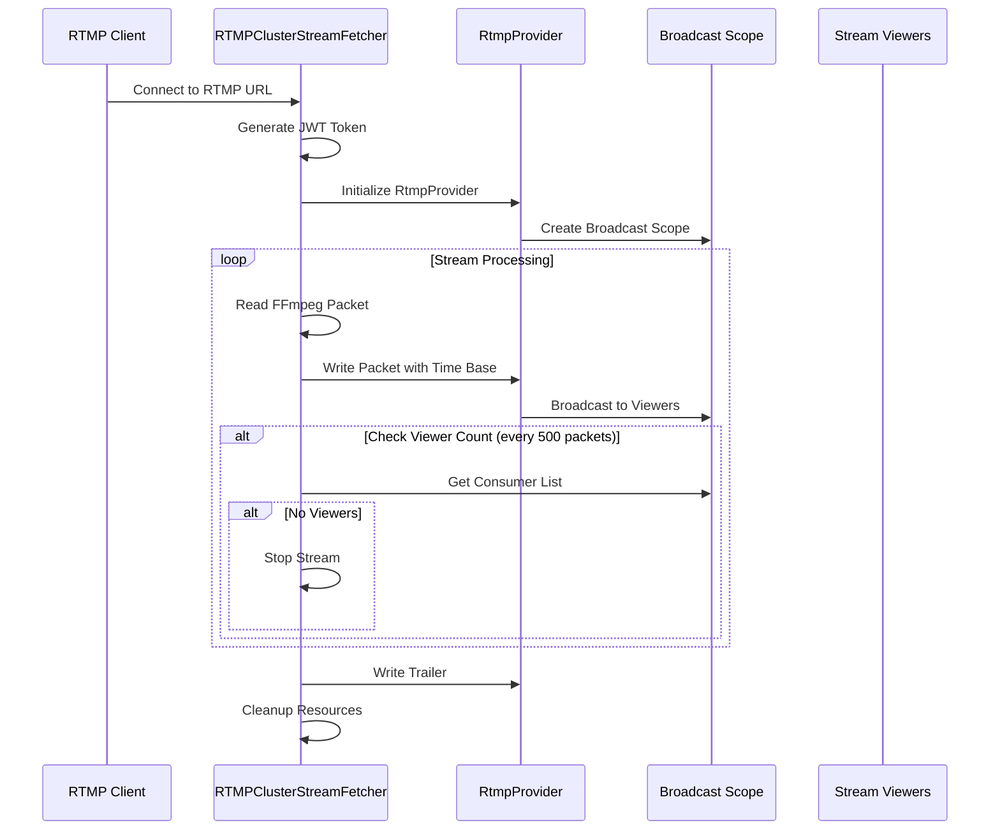
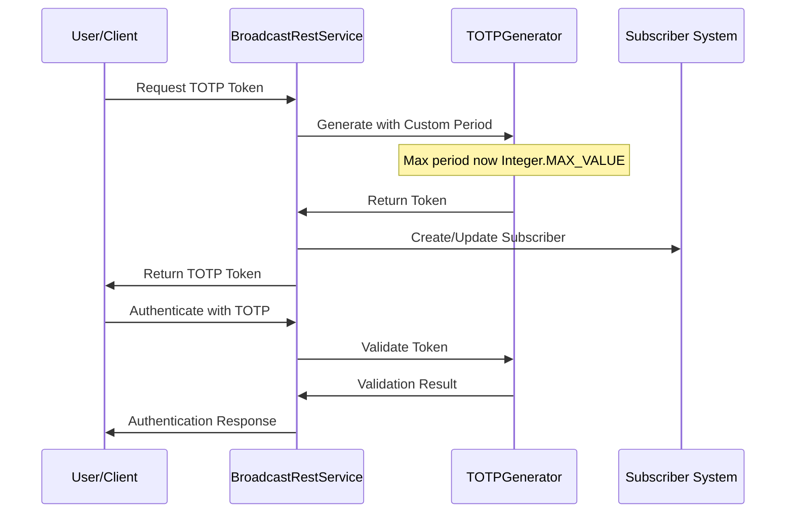
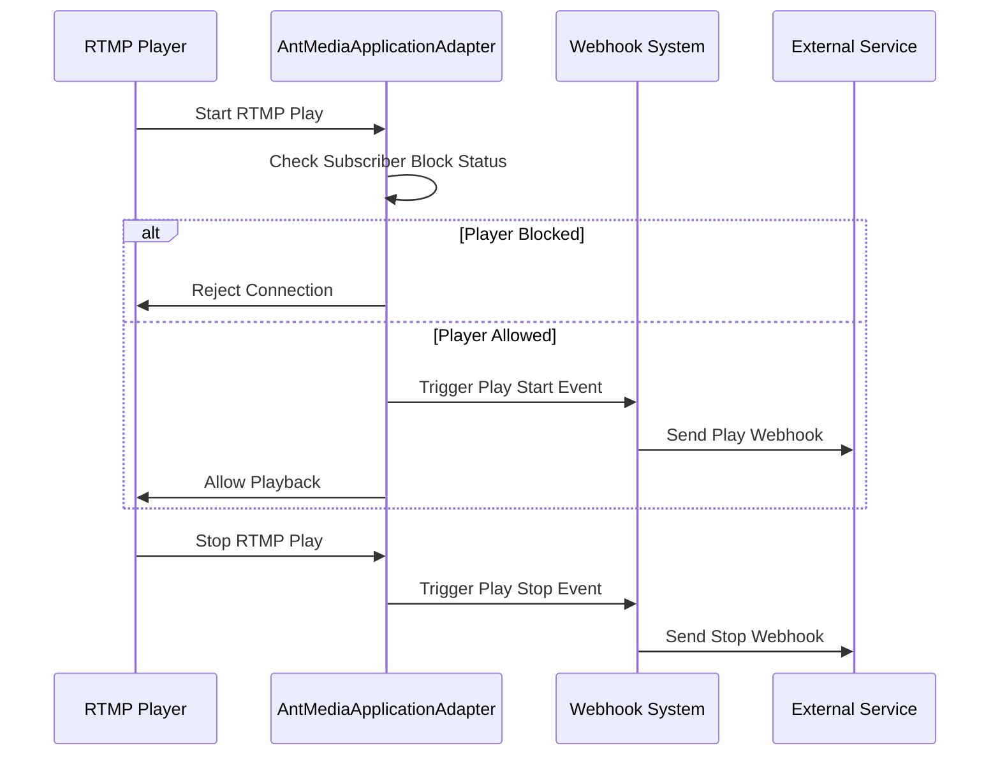

# Monthly Changes Summary - September 2025
*Analysis Period: August 20, 2025 - September 18, 2025*

## Executive Summary

This month brought significant enhancements to Ant Media Server's streaming capabilities, security features, and system reliability. Key developments include major improvements to RTMP cluster streaming, enhanced TOTP authentication security, new webhook functionality for real-time event monitoring, and comprehensive test stability improvements.

## Major Features & Enhancements

### 🔐 Security & Authentication
- **TOTP Enhancement** (PR #7486): Increased maximum TOTP (Time-based One-Time Password) duration to `Integer.MAX_VALUE`, providing greater flexibility for authentication token lifespans
- **Custom TOTP Time Configuration** (PR #7360): Added support for custom TOTP time periods with refactored subscriber management

### 🎥 RTMP Streaming Infrastructure
- **RTMPClusterStreamFetcher** (PR #7358): Complete new implementation for cluster-based RTMP streaming
  - New `RTMPClusterStreamFetcher` class with FFmpeg integration
  - Automatic viewer detection and stream lifecycle management
  - JWT token-based authentication for cluster communication
  - Optimized packet processing with proper time base handling

- **RTMP Webhooks & Player Control** (PR #7478): Enhanced real-time monitoring capabilities
  - New webhooks for RTMP play/stop events
  - Subscriber ID-based RTMP player blocking
  - Improved stream access control mechanisms

### 🌐 HTTP & CORS Improvements
- **HLS HTTP Forwarding** (PR #7448): Fixed CORS header handling in HLS redirects
- **HTTP Timeout Fixes** (PR #7376): Resolved timeout issues for file-based operations

### 📚 Documentation
- **README Updates** (PR #7475): Comprehensive documentation improvements for better developer onboarding

## Technical Implementation Details

### RTMP Cluster Streaming Architecture

### TOTP Authentication Flow

### Webhook Event System

## Bug Fixes & Stability Improvements

### Test Infrastructure
- **Test Stability Enhancements**: Multiple commits improving test reliability
  - Fixed timeout issues in integration tests
  - Improved test isolation and cleanup
  - Enhanced error handling in unit tests

### Core System Fixes
- **NPE Prevention**: Added server settings initialization to prevent null pointer exceptions
- **Stream Fetcher Improvements**: Enhanced PlayEngine flexibility and StreamFetcher scenario handling
- **Code Cleanup**: Removed duplicate code snippets in StreamService

## File Changes Summary

### Core Components Modified
- `AntMediaApplicationAdapter.java`: Enhanced with RTMP webhook support and NPE fixes
- `BroadcastRestService.java`: TOTP improvements and subscriber management
- `RTMPClusterStreamFetcher.java`: **New file** - Complete RTMP cluster streaming implementation
- `RtmpProvider.java`: Renamed from `InProcessRtmpProvider.java` with enhanced functionality

### Test Infrastructure
- Multiple test files updated for improved stability
- New test coverage for RTMP cluster functionality
- Enhanced integration test reliability

## Performance & Monitoring

### Stream Management
- Automatic viewer detection for RTMP streams
- Optimized packet processing with proper time base conversion
- Enhanced resource cleanup and memory management

### Security Enhancements
- JWT-based cluster communication
- Improved subscriber blocking mechanisms
- Enhanced TOTP token flexibility

## Breaking Changes
- `InProcessRtmpProvider.java` renamed to `RtmpProvider.java`
- Some internal API changes in stream fetcher interfaces

## Migration Notes
- No user-facing breaking changes
- Internal refactoring maintains backward compatibility
- New webhook endpoints available for RTMP events

---

*This summary covers 30 days of development activity from the christina-pan-windsurf/Ant-Media-Server repository.*
