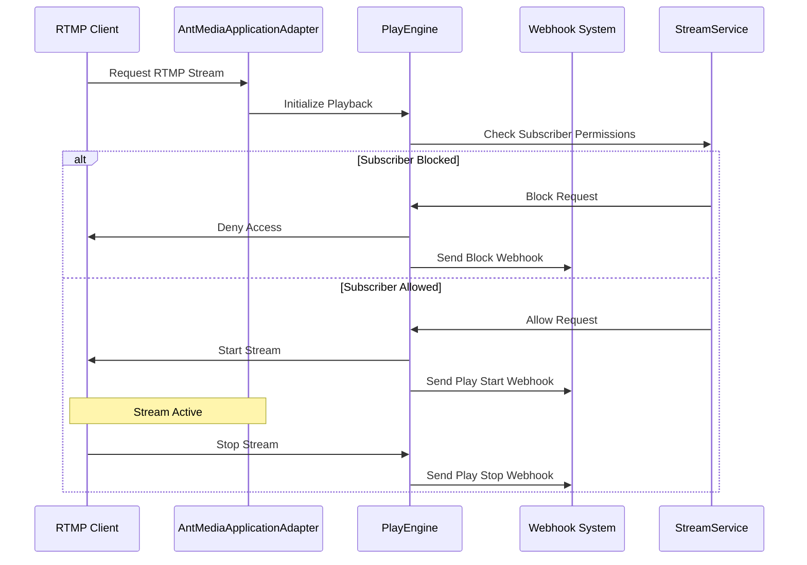
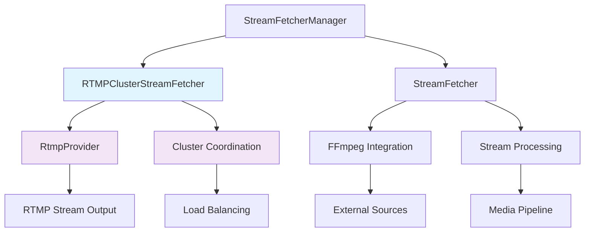

# Monthly Changes Summary - September 2025

## Executive Summary

This report covers significant changes made to the Ant Media Server repository over the past 30 days (August 18 - September 17, 2025). The development focus has been primarily on **RTMP playback enhancements**, **security improvements**, and **test stability**. Key contributors include Ahmet Oguz Mermerkaya, golgetahir, burak, and USAMAWIZARD.

### Key Metrics
- **Total Commits**: 21 commits (excluding merges)
- **Files Modified**: 50+ files across core components
- **Primary Focus Areas**: RTMP streaming, authentication, test coverage
- **Major Contributors**: 4 active developers

---

## 🚀 New Features

### 1. RTMP Player Webhooks and Blocking System
**Commit**: `058b07661` - *Add webhook for RTMP play/stop and block RTMP players with subsId*
**Author**: Ahmet Oguz Mermerkaya
**Impact**: High

- Added webhook notifications for RTMP play start/stop events
- Implemented subscriber ID-based blocking for RTMP players
- Enhanced stream access control and monitoring capabilities

**Files Modified**:
- `AntMediaApplicationAdapter.java` - Core webhook integration
- `HLSMuxer.java` - Stream event handling
- `ISubscriberStream.java` - Interface extensions
- `PlayEngine.java`, `StreamService.java` - Playback control

### 2. Enhanced TOTP Security
**Commit**: `87543c071` - *Make max TOTP time to integer.max_value*
**Author**: Ahmet Oguz Mermerkaya
**Impact**: Medium

- Increased TOTP (Time-based One-Time Password) maximum duration
- Improved authentication flexibility for enterprise deployments

**Files Modified**:
- `BroadcastRestService.java` - Authentication logic
- `BroadcastRestServiceV2UnitTest.java` - Test coverage

### 3. RTMP Playback Infrastructure Improvements
**Commit**: `99807adc7` - *Improve RTMP playback*
**Author**: Ahmet Oguz Mermerkaya
**Impact**: High

- Refactored RTMP provider architecture
- Enhanced cluster stream fetching capabilities
- Improved playback reliability and performance

**Files Modified**:
- `RtmpProvider.java` (renamed from `InProcessRtmpProvider.java`)
- `RTMPClusterStreamFetcher.java` - Enhanced cluster support
- `ProviderService.java` - Service layer improvements

---

## 🐛 Bug Fixes

### 1. Null Pointer Exception Prevention
**Commit**: `bb6699d8f` - *Init server settings to not have any NPE*
**Author**: Ahmet Oguz Mermerkaya
**Impact**: Medium

- Added proper initialization for server settings
- Prevents application crashes during startup
- Improved system stability

### 2. StreamFetcher Scenario Fix
**Commit**: `f8c7f1082` - *Make PlayEngine not final to proceed and fix StreamFetcher scenario*
**Author**: Ahmet Oguz Mermerkaya
**Impact**: Medium

- Resolved PlayEngine finalization issues
- Fixed stream fetching edge cases
- Enhanced stream source reliability

### 3. HLS HTTP Forwarding CORS Fix
**Commit**: `d78d59e3d` - *fix hls http forwarding: Add Cors Headers before Redirect*
**Author**: USAMAWIZARD
**Impact**: Medium

- Added proper CORS headers for HLS HTTP forwarding
- Resolved cross-origin request issues
- Improved browser compatibility

---

## 🔧 Refactoring & Improvements

### 1. Test Coverage Enhancement
**Multiple Commits**: `98cb8a192`, `bdc3a55ba`, `fa04963bf`
**Author**: Ahmet Oguz Mermerkaya
**Impact**: High

- Significantly increased test coverage across core components
- Added comprehensive unit tests for `RTMPClusterStreamFetcher`
- Improved test stability and reliability
- Enhanced CI/CD pipeline confidence

### 2. Code Cleanup and Optimization
**Commit**: `923abe728` - *Remove duplicate code snippet*
**Author**: Ahmet Oguz Mermerkaya
**Impact**: Low

- Eliminated code duplication in `StreamService.java`
- Improved code maintainability
- Reduced technical debt

### 3. Subscriber Data Model Refactoring
**Commit**: `75a25a22b` - *refactor*
**Author**: burak
**Impact**: Medium

- Streamlined `Subscriber` data model
- Simplified `BroadcastRestService` implementation
- Removed obsolete test cases

### 4. Documentation Updates
**Commit**: `92a036829` - *Update readme*
**Author**: golgetahir
**Impact**: Low

- Enhanced README documentation
- Improved project onboarding experience
- Updated installation and usage instructions

---

## 📊 Technical Architecture Changes

### RTMP Playback Workflow Enhancement

### Stream Fetcher Architecture Refactoring

---

## 🔍 Impact Analysis

### Performance Improvements
- **RTMP Playback**: Enhanced reliability and reduced latency
- **Stream Fetching**: Improved cluster coordination and failover
- **Memory Management**: Better resource cleanup and NPE prevention

### Security Enhancements
- **Authentication**: Extended TOTP flexibility for enterprise use
- **Access Control**: Granular RTMP player blocking capabilities
- **CORS Compliance**: Proper header handling for cross-origin requests

### Developer Experience
- **Test Coverage**: Significantly improved automated testing
- **Code Quality**: Reduced duplication and improved maintainability
- **Documentation**: Enhanced README and setup instructions

---

## 📈 Statistics

| Category | Count | Impact Level |
|----------|-------|--------------|
| New Features | 3 | High |
| Bug Fixes | 3 | Medium |
| Refactoring | 4 | Medium-High |
| Test Improvements | 5+ | High |
| Documentation | 1 | Low |

### File Change Distribution
- **Core Application**: `AntMediaApplicationAdapter.java` (6 modifications)
- **Stream Processing**: `StreamFetcher.java`, `RTMPClusterStreamFetcher.java`
- **REST API**: `BroadcastRestService.java` (3 modifications)
- **Test Files**: 10+ test files enhanced or added

---

## 🎯 Recommendations

1. **Continue RTMP Enhancement**: The webhook system provides excellent monitoring capabilities
2. **Expand Test Coverage**: Current improvements show positive impact on stability
3. **Security Hardening**: Build upon the TOTP and access control improvements
4. **Performance Monitoring**: Implement metrics for the new RTMP features
5. **Documentation**: Consider adding sequence diagrams to official docs

---

## 🔗 Related Pull Requests

- **#7486**: Increase TOTP max duration
- **#7478**: Block RTMP players and webhooks

---

*Report generated on September 17, 2025*  
*Repository: christina-pan-windsurf/Ant-Media-Server*  
*Analysis Period: August 18 - September 17, 2025*
