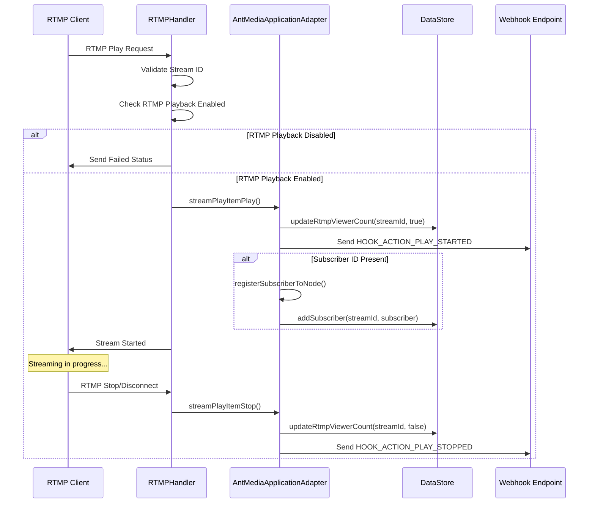
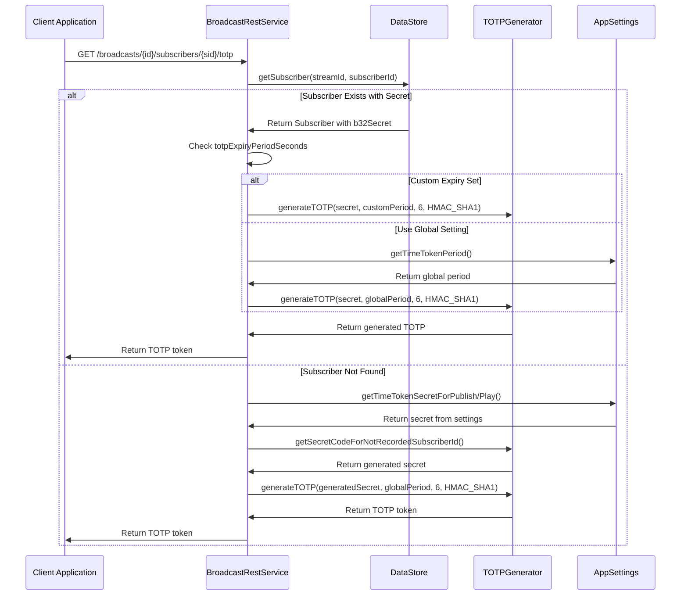

# Ant Media Server - Monthly Changes Summary
**Period: August 17, 2025 - September 17, 2025**

## Executive Summary

This month brought significant enhancements to Ant Media Server's authentication and streaming capabilities. The major highlights include flexible TOTP authentication with custom expiry periods, comprehensive RTMP playback webhook system, and various stability improvements. A total of 33 commits were made during this period, focusing on security enhancements, streaming reliability, and developer experience improvements.

## Key Features and Enhancements

### 🔐 Enhanced TOTP Authentication System

#### Custom TOTP Expiry Periods
- **Feature**: Implemented per-subscriber custom TOTP expiry periods
- **Benefit**: Allows fine-grained control over token validity periods for different subscribers
- **Implementation**: Added `totpExpiryPeriodSeconds` field to Subscriber entity
- **Fallback**: Gracefully falls back to global `timeTokenPeriod` setting when custom period is not set

#### Increased Maximum TOTP Duration
- **Change**: Raised maximum TOTP duration limit to `Integer.MAX_VALUE`
- **Impact**: Removes practical limitations on token validity periods
- **Use Case**: Supports long-running streaming sessions and extended authentication scenarios

### 📡 RTMP Playback Webhook System

#### Comprehensive Event Tracking
- **New Events**: Added webhook notifications for RTMP play start and stop events
- **Integration**: Seamlessly integrated with existing webhook infrastructure
- **Parameters**: Includes stream parameters and subscriber information in webhook payloads

#### Subscriber Management Enhancement
- **Registration**: Automatic subscriber registration during RTMP playback
- **Node Tracking**: Tracks which server node handles each subscriber
- **Connection State**: Maintains subscriber connection status across the cluster

#### RTMP Playback Control
- **Feature**: Added ability to disable RTMP playback globally
- **Configuration**: Controlled via `rtmpPlaybackEnabled` application setting
- **Security**: Provides additional control over streaming access

## Bug Fixes and Improvements

### 🔧 VoD Linear Streaming Fixes
- **Issue**: Playback stops in VoD Linear Streaming for long files
- **Solution**: Fixed HTTP timeout configuration in Tomcat container
- **Impact**: Improved reliability for long-duration video content

### 🌐 HLS CORS Improvements
- **Fix**: Added proper CORS headers before HTTP redirects in HLS forwarding
- **Benefit**: Better cross-origin support for HLS streaming
- **Compliance**: Ensures proper browser security policy adherence

### 🧪 Test Stability Enhancements
- **Improvements**: Multiple commits focused on improving test reliability
- **Coverage**: Increased test coverage for RTMP playback scenarios
- **Stability**: Reduced flaky test failures in CI/CD pipeline

## Refactoring and Code Quality

### Code Organization
- **Refactoring**: Cleaned up duplicate code snippets
- **Structure**: Improved code organization in streaming components
- **Maintainability**: Enhanced code readability and maintainability

### PlayEngine Improvements
- **Change**: Made PlayEngine non-final to support inheritance
- **Benefit**: Enables better extensibility for custom streaming scenarios
- **Fix**: Resolved StreamFetcher scenario issues

## Sequence Diagrams

### RTMP Playback Webhook Flow

### TOTP Authentication Flow with Custom Expiry

## Detailed Change Log

### Major Commits

| Commit | Author | Description | Impact |
|--------|--------|-------------|---------|
| `87543c071` | Ahmet Oguz Mermerkaya | Make max TOTP time to integer.max_value | Security Enhancement |
| `058b07661` | Ahmet Oguz Mermerkaya | Add webhook for RTMP play/stop and block RTMP players with subsId | Feature Addition |
| `22afdea7a` | Multiple | Implement custom expiry time on totp tokens | Feature Addition |
| `4e1610905` | burak-58 | Fix playback stops in VoD Linear Streaming for long files | Bug Fix |
| `d78d59e3d` | USAMAWIZARD | Fix HLS HTTP forwarding: Add CORS headers before redirect | Bug Fix |

### Configuration Changes

- **TOTP Settings**: Enhanced with per-subscriber custom expiry periods
- **RTMP Settings**: Added `rtmpPlaybackEnabled` configuration option
- **HTTP Settings**: Improved timeout configuration for long file handling

### API Enhancements

- **TOTP Endpoint**: Enhanced to support custom expiry periods with fallback logic
- **Webhook Events**: Added new event types for RTMP playback lifecycle
- **Subscriber Management**: Improved subscriber registration and tracking

## Migration Notes

### For Developers
- The `totpExpiryPeriodSeconds` field in Subscriber entity is optional and backward compatible
- Existing TOTP implementations will continue to work with global settings
- RTMP playback can be controlled via application settings

### For Administrators
- Review RTMP playback settings if security policies require restricted access
- Consider configuring custom TOTP expiry periods for different subscriber tiers
- Monitor webhook endpoints for new RTMP playback events

## Performance Impact

- **Minimal Overhead**: New features add minimal performance overhead
- **Improved Reliability**: VoD streaming fixes reduce timeout-related issues
- **Better Monitoring**: Enhanced webhook system provides better observability

## Security Considerations

- **Enhanced Control**: RTMP playback can now be disabled globally for security
- **Flexible Authentication**: Custom TOTP expiry periods allow security policy compliance
- **Subscriber Tracking**: Improved subscriber management enhances security monitoring

---

**Total Commits Analyzed**: 33  
**Contributors**: Ahmet Oguz Mermerkaya, burak-58, USAMAWIZARD, USAMA  
**Generated**: September 17, 2025
